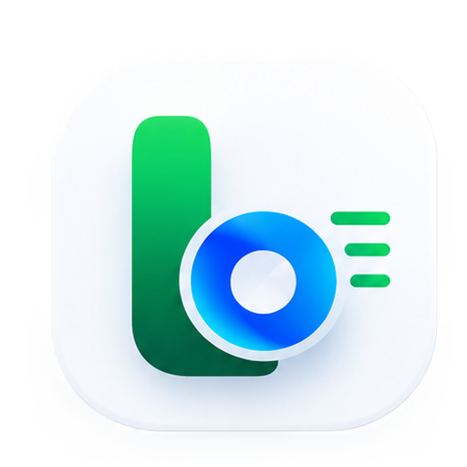
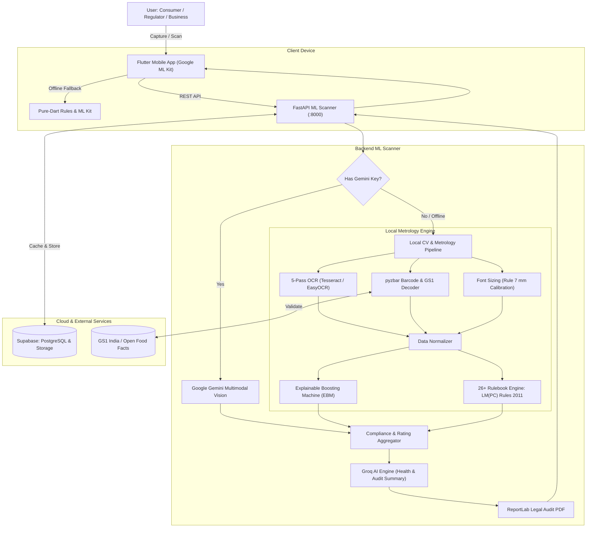

<div align="center">



# LabelLens — Legal Metrology Compliance Platform
### Smart India Hackathon (SIH 2026)

**AI-powered packaged commodity auditing and statutory compliance automation under the Legal Metrology (Packaged Commodities) Rules, 2011.**

[](https://flutter.dev)
[](https://fastapi.tiangolo.com)
[](https://python.org)
[](https://ai.google.dev)
[](https://groq.com)
[](https://supabase.com)

</div>

---

## ⚡ Tech Stack

| Layer | Technologies |
|---|---|
| **Mobile Client** | Flutter 3.24+, Material Design 3, Google ML Kit (Text & Barcode), CameraX |
| **Backend Service** | FastAPI (async Python), Uvicorn, Astral `uv`, Pydantic v2 |
| **Computer Vision** | 5-Pass Adaptive OCR (Tesseract & EasyOCR), OpenCV, `pyzbar` |
| **Metrology & ML** | 26+ Rulebook Engine (LM(PC) Rules 2011), Explainable Boosting Machine (EBM) |
| **AI Intelligence** | Google Gemini Multimodal Vision, Groq LLM (Consumer Summaries & Food Health Audit) |
| **Storage & Data** | Supabase (PostgreSQL, Auth, Storage), GS1 India / Open Food Facts |

---

## 🏛️ System Architecture

LabelLens uses a **hybrid dual-engine architecture**:
- **Cloud Route**: Google Gemini Multimodal Vision for instant end-to-end visual parsing.
- **Local Route**: Air-gapped fallback with 5-pass OCR, physical font calibration, Explainable Boosting Machine (EBM), and 26+ deterministic statutory rule checks.
- **Barcode-First**: Instant GS1 GTIN verification against official registries without uploading photos.



---

## 🔬 How Label Scanning Works

The compliance pipeline evaluates product packaging through 5 streamlined stages:

1. **Multi-Angle Ingestion**: Captures front label (PDP), back declarations, barcode crop, and optional ruler calibration scale with automated image downscaling.
2. **Barcode & GS1 Verification**: Validates EAN-13 checksums, verifies GS1 India country prefix (`890`), and cross-references canonical product registries.
3. **Adaptive OCR & Font Calibration**: Runs a 5-pass preprocessing pipeline (CLAHE, tophat, unsharp masking, inverted binary) with spatial IOU deduplication. Calibrates mm font height using ruler or barcode dimensions to verify **Rule 7** minimum font heights.
4. **Dual Compliance Engine**:
   - **Deterministic Rulebook**: Validates 26+ statutory declarations under LM(PC) Rules 2011 (MRP suffix, USP, Net Qty, Dates, Packer details, Consumer Care).
   - **Explainable ML (EBM)**: Glass-box GAM providing auditable risk factor contributions.
   - **Gemini Vision**: Multimodal visual cross-validation.
5. **AI Summaries & Legal PDF**: Groq LLM generates plain-language consumer insights and screens for hazardous food additives (synthetic dyes, palm oil, high sodium/sugar). Compiles formal tabular legal audit PDFs via ReportLab.

---

## 🚀 Quickstart

### Prerequisites
- **Python >= 3.11** (pinned to `3.14` in `.python-version`) & **[Astral uv](https://docs.astral.sh/uv/)**
- **Native packages**: `tesseract-ocr`, `libzbar-dev`
- **Flutter SDK >= 3.24.0**

### 1. ML Scanner Backend
```bash
cd services/ml-scanner
cp .env.example .env
uv sync --locked
uv run uvicorn server:app --host 0.0.0.0 --port 8000 --reload
```
- API Docs: [http://localhost:8000/docs](http://localhost:8000/docs)
- Health Check: [http://localhost:8000/health](http://localhost:8000/health)

### 2. Mobile App (Flutter)
```bash
cd apps/mobile
flutter pub get
flutter run
```
*Note: If running on an Android device over USB, run `adb reverse tcp:8000 tcp:8000` to connect to your local backend.*

---

## ⚙️ Environment Variables (`.env`)

Configure in `services/ml-scanner/.env`:

| Variable | Description | Required |
|---|---|:---:|
| `GEMINI_API_KEY` | Google Gemini API key for multimodal vision audit | Recommended |
| `GROQ_API_KEY` | Groq key for consumer health summaries & additive screening | Recommended |
| `SUPABASE_URL` | Supabase project URL for scan caching and PDF storage | Recommended |
| `SUPABASE_KEY` | Supabase Anon or Service Role key | Recommended |
| `PORT` | Local service port (Default: `8000`) | Optional |

> *Note: If API keys are omitted, the backend automatically falls back to local OCR, the EBM model, and deterministic rule evaluation.*

---

## 📡 Key API Endpoints

| Method | Endpoint | Description |
|:---:|---|---|
| `GET` | `/health` | Service health status |
| `POST` | `/analyze` | Multi-image label compliance analysis (`multipart/form-data`) |
| `POST` | `/scan-barcode` | GS1 barcode verification and registry lookup |
| `POST` | `/summarize/consumer` | Plain-language consumer summary, health score & additive screening |
| `POST` | `/summarize/regulator` | Executive regulatory audit summary & formal tabular PDF |
| `GET` | `/report/{scan_id}/download` | Direct stream of tabular legal audit PDF |
| `GET` | `/docs` | Interactive Swagger / OpenAPI documentation |

---

<div align="center">
  <b>Built for Smart India Hackathon 2026 | Legal Metrology Compliance Platform</b>
</div>
