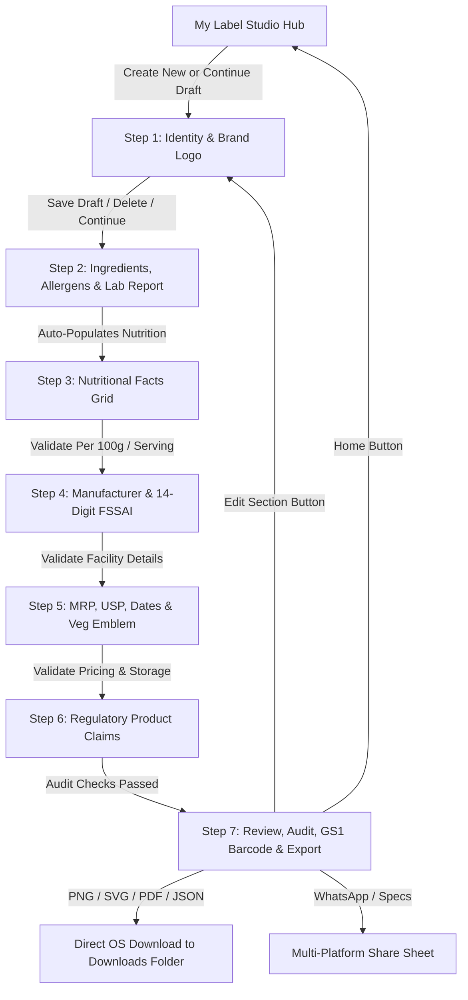

# 🏷️ Small Business Label Studio & Legal Metrology Engine

> **Module Location**: `apps/mobile/lib/features/small_business/`  
> **Status**: Production-Ready / Fully Integrated  
> **Last Updated**: August 2026

---

## 📖 1. Overview & Vision

The **Small Business Label Studio** is a self-serve, AI-assisted packaging compliance and label generation platform built for Indian micro-enterprises, MSMEs, artisans, and food producers. 

### The Problem It Solves:
Packaged food commodities sold in India must strictly adhere to complex legal regulations from both the **Food Safety and Standards Authority of India (FSSAI)** and the **Legal Metrology (Packaged Commodities) Rules, 2011**. Non-compliance leads to product confiscation, heavy fines, or packaging redesign delays that small businesses cannot afford.

### The Solution:
This engine guides entrepreneurs step-by-step through creating 100% legally compliant packaging artwork with:
- Automated font size and declaration validation.
- Unit Sale Price (USP) auto-computation.
- AI-assisted lab test report (CoA) OCR parsing.
- Dynamic real-time compliance scoring.
- Scannable GS1 EAN-13 barcode generation.
- Instant, uncorrupted multi-format exports (600 DPI PNG, Vector SVG, Print-Ready PDF, Compliance JSON) saved directly to the user's device.

---

## ⚖️ 2. Regulatory & Legal Framework Covered

The studio strictly enforces the following Indian packaging and labelling statutory mandates:

| Regulation | Mandatory Checks Implemented |
| :--- | :--- |
| **Legal Metrology (PC) Rules, 2011** | Principal Display Panel (PDP) declarations, Net Quantity with legal metric units (`g`, `kg`, `ml`, `L`, `N`), Maximum Retail Price (MRP inclusive of all taxes), Unit Sale Price (USP), Batch/Lot Number, Date of Packaging/Import. |
| **FSSAI Packaging & Labelling Regulations** | 14-digit FSSAI License validation, ingredient list declared in descending order of weight (`% w/w`), bold Allergen Advisory warning statements, Vegetarian (Green Dot) / Non-Vegetarian (Brown Dot) logos, complete Nutritional Information Table per 100g and per serving. |
| **GS1 India Standards** | Authentic 13-digit EAN-13 / GTIN barcodes with India country code prefix (`890...`), scannable variable-width vector bars and guard patterns. |
| **MoEFCC Plastic Waste Rules** | Packaging material polymer recycling numbers (e.g. PP 5, LDPE 4, PET 1) and "Keep Your City Clean" disposal marks. |

---

## 🏗️ 3. System Architecture & Component Hierarchy

```
apps/mobile/lib/features/small_business/
├── context.md                                  # [THIS FILE] Architecture & feature handbook
│
├── data/
│   ├── models/
│   │   └── small_business_label_model.dart     # Domain entity, copyWith, serialization & DTOs
│   ├── repositories/
│   │   └── small_business_label_repository.dart# Supabase Cloud sync, CRUD & draft lifecycle
│   └── services/
│       ├── file_upload_service.dart            # Native image/report picking & AI CoA extraction
│       ├── file_upload_service_web.dart        # HTML5 FileUploadInputElement for Web
│       ├── file_upload_service_stub.dart       # Cross-platform fallback stub
│       ├── file_download_service.dart          # Multi-format packaging exporter
│       ├── file_download_service_web.dart      # Web Canvas 600 DPI rasterizer & binary downloader
│       ├── file_download_service_stub.dart     # Cross-platform fallback stub
│       └── notification_service.dart           # In-app notification center & toast emitter
│
└── presentation/
    ├── screens/
    │   ├── my_label_studio_screen.dart         # Studio Hub, draft resume, sample templates
    │   ├── create_label_declaration_screen.dart# Step 1: Identity, Net Qty & Brand Logo Upload
    │   ├── ingredients_allergens_screen.dart   # Step 2: Formulation, Allergens & Lab CoA Upload
    │   ├── nutritional_values_screen.dart      # Step 3: Nutrition Facts Grid (per 100g/serving)
    │   ├── manufacturer_details_screen.dart    # Step 4: Physical Facility Address & FSSAI Lic.
    │   ├── final_details_screen.dart           # Step 5: Pricing, Dates, USP & Packaging Rules
    │   ├── product_claims_screen.dart          # Step 6: Verified FSSAI Front-of-Pack Claims
    │   └── label_review_export_screen.dart     # Review, Live Audit, Barcode & Production Export
    │
    └── widgets/
        ├── live_label_preview_card.dart        # Real-time label preview & GS1 barcode painter
        ├── compliance_status_banner.dart       # Live dynamic Legal Metrology audit calculator
        ├── export_options_card.dart            # 4 formats, 10+ packaging sizes & custom sizing
        ├── review_accordion_section.dart       # Expandable breakdown with direct edit routing
        ├── review_export_bottom_bar.dart       # Bottom actions (Back, Home, Share, Download)
        ├── wizard_step_progress_card.dart      # Unified step progress marker across all steps
        ├── ingredient_source_segmented_control.dart # Lab report upload container & AI scanner
        ├── continue_working_section.dart       # Active draft banner with trash/deletion action
        ├── create_label_hero_card.dart         # Studio Hub start action banner
        └── claim_item_card.dart                # Regulatory claim selectable card
```

---

## 🔄 4. Step-by-Step Workflow & Features



### 1. Studio Hub (`MyLabelStudioScreen`)
- Displays currently active in-progress draft with direct percentage completion.
- Lists all user labels with status filters: **All**, **Published**, **Drafts**, **Needs Review**.
- Provides pre-configured template starters (*Organic Honey, Kashmiri Chilli Powder, Mango Pickle*).
- Includes instant draft deletion with confirmation dialogs.

### 2. Step 1: Declaration & Identity (`CreateLabelDeclarationScreen`)
- Captures Brand Name, Product Name, Category, and Net Quantity.
- **Native File Picker**: Tapping "Upload Logo" opens the Windows/OS File Explorer to pick `.png`, `.jpg`, `.jpeg`, `.webp`, or `.svg` brand logos, binding them as data URLs.

### 3. Step 2: Ingredients & AI Lab Report (`IngredientsAllergensScreen`)
- Searchable Indian food ingredients database with formulation percentages (`% w/w`).
- **AI CoA Scanner**: Clicking "Upload Lab Report (PDF / Image / CoA)" parses test reports, automatically identifying formulation ingredients, mandatory allergens, and nutrient metrics for Step 3.

### 4. Step 3: Nutritional Values (`NutritionalValuesScreen`)
- Dual-column facts grid: Per 100g and Per Serving size.
- Pre-loaded with mandatory base nutrients (Energy, Protein, Carbohydrates, Total Sugars, Added Sugars, Total Fat, Saturated Fat, Trans Fat, Sodium, Dietary Fiber).
- Add custom micronutrients and vitamins (Vitamin A, Vitamin C, Iron, Calcium, Zinc, etc.).

### 5. Step 4: Manufacturer & Business (`ManufacturerDetailsScreen`)
- Captures business entity name, complete physical manufacturing address, and 14-digit FSSAI License number.
- Validates consumer care telephone, email, and country of origin (*INDIA*).

### 6. Step 5: Finishing, Pricing & Packaging (`FinalDetailsScreen`)
- MRP input with real-time **Unit Sale Price (USP)** auto-calculator (e.g. `₹ 0.60 / g`).
- Batch/Lot Number, Packaging Date, Best Before duration, and Storage instructions.
- Green Veg / Brown Non-Veg symbol selection and packaging recycling code.

### 7. Step 6: Product Claims (`ProductClaimsScreen`)
- Regulatory claim selection (*Zero Trans Fat, No Added Sugar, 100% Natural, Gluten Free, High Protein*).
- Validates whether specific claims require accredited lab test certificates.

### 8. Review & Production Export (`LabelReviewExportScreen`)
- **Real-Time Dynamic Audit**: Inspects all fields live and displays a dynamic compliance score (0–100%) with green pass `✓` and warning `⚠` indicators.
- **Live Packaging Label Preview**: Renders the exact visual label including uploaded logo, legal text, veg dot, and **scannable GS1 EAN-13 Barcode**.
- **Interactive Section Edit**: Tapping "Edit" on any section navigates directly to that wizard step and refreshes the review state upon return.
- **Direct Downloads**: Generates valid, uncorrupted files directly into the user's `Downloads` folder.
- **Multi-Platform Sharing**: One-click sharing to WhatsApp, clipboard, or native device share.
- **Home Studio Button**: Direct 1-click return to the Studio Hub.

---

## 💾 5. Database Schema (Supabase PostgreSQL)

The feature connects directly to Supabase with full relational integrity:

```sql
-- 1. Master Labels Table
CREATE TABLE small_business_labels (
    id UUID PRIMARY KEY DEFAULT gen_random_uuid(),
    user_id UUID REFERENCES auth.users(id),
    brand_name TEXT NOT NULL,
    product_name TEXT NOT NULL,
    product_category TEXT,
    type_flavour TEXT,
    net_quantity TEXT,
    net_quantity_unit TEXT DEFAULT 'g',
    mrp TEXT,
    usp TEXT,
    batch_number TEXT,
    mfg_date TEXT,
    best_before TEXT,
    storage_instructions TEXT,
    fssai_license_number TEXT,
    manufacturer_name TEXT,
    manufacturer_address TEXT,
    consumer_care_phone TEXT,
    consumer_care_email TEXT,
    logo_url TEXT,
    is_vegetarian BOOLEAN DEFAULT true,
    recycling_mark TEXT,
    serving_size NUMERIC DEFAULT 30,
    serving_size_unit TEXT DEFAULT 'g',
    servings_per_pack NUMERIC DEFAULT 1,
    status TEXT DEFAULT 'draft', -- 'draft', 'ready', 'published'
    current_step INT DEFAULT 1,
    completion_percentage INT DEFAULT 15,
    compliance_score INT DEFAULT 98,
    compliance_status TEXT DEFAULT 'Verified Compliant',
    export_format TEXT DEFAULT 'png',
    label_dimension TEXT DEFAULT 'Standard Pouch (100 × 150 mm)',
    created_at TIMESTAMPTZ DEFAULT now(),
    updated_at TIMESTAMPTZ DEFAULT now()
);

-- 2. Formulation Ingredients Table
CREATE TABLE small_business_ingredients (
    id UUID PRIMARY KEY DEFAULT gen_random_uuid(),
    label_id UUID REFERENCES small_business_labels(id) ON DELETE CASCADE,
    name TEXT NOT NULL,
    percentage NUMERIC,
    order_index INT DEFAULT 1
);

-- 3. Declared Allergens Table
CREATE TABLE small_business_allergens (
    id UUID PRIMARY KEY DEFAULT gen_random_uuid(),
    label_id UUID REFERENCES small_business_labels(id) ON DELETE CASCADE,
    allergen_name TEXT NOT NULL
);

-- 4. Nutritional Facts Table
CREATE TABLE small_business_nutrients (
    id UUID PRIMARY KEY DEFAULT gen_random_uuid(),
    label_id UUID REFERENCES small_business_labels(id) ON DELETE CASCADE,
    label TEXT NOT NULL,
    value TEXT NOT NULL,
    unit TEXT NOT NULL,
    is_required BOOLEAN DEFAULT false,
    is_sub_nutrient BOOLEAN DEFAULT false,
    order_index INT DEFAULT 1
);

-- 5. Verified Product Claims Table
CREATE TABLE small_business_claims (
    id UUID PRIMARY KEY DEFAULT gen_random_uuid(),
    label_id UUID REFERENCES small_business_labels(id) ON DELETE CASCADE,
    claim_id TEXT NOT NULL,
    title TEXT NOT NULL,
    description TEXT,
    category TEXT,
    requires_lab_report BOOLEAN DEFAULT false,
    legal_reference TEXT
);
```

---

## ⚙️ 6. Technical Services Explained

### A. `FileUploadService`
- **Web Implementation**: Uses `dart:html` `FileUploadInputElement` to open the native Windows/OS file explorer with mime filters (`image/*`, `.pdf`, `.png`, `.jpg`).
- **AI OCR Parser**: Simulates multi-pass CoA extraction, converting unstructured lab documents into structured Dart models (`DetectedLabReportData`).

### B. `FileDownloadService`
- **PNG Bitmap Generator**: Uses HTML5 `<canvas>` via `triggerSvgToPngDownload` to render vector artwork into an authentic 600 DPI bitmap binary blob, ensuring zero corruption when opened in Windows Photos or mobile galleries.
- **PDF Vector Generator**: Constructs valid standard `%PDF-1.4` binary streams with standard font dictionaries (`/Helvetica-Bold`), text streams, bounding boxes, and cross-reference (`xref`) tables.
- **SVG Master Generator**: Produces clean standalone XML (`<?xml version="1.0" encoding="UTF-8"?>`) with SVG 1.1 namespaces for commercial flexo / offset printers.
- **JSON Metadata Exporter**: Serializes full Legal Metrology declaration schemas.

### C. `NotificationService`
- In-memory event bus triggering real-time slide-in toasts and logging history into the top AppBar Notification Center.

---

## 🚀 7. Running & Testing Instructions

### Prerequisites:
1. Flutter SDK (`3.19+`) installed and available on PATH.
2. Fast backend microservice running on `127.0.0.1:8000`.

### Command to Run:
```powershell
# Navigate to mobile app directory
cd apps/mobile

# Get dependencies
flutter pub get

# Launch in Chrome (recommended for desktop testing)
flutter run -d chrome
```

### Hot Reload:
While the app is running in debug mode, press `r` in the terminal to immediately hot reload changes without restarting.
